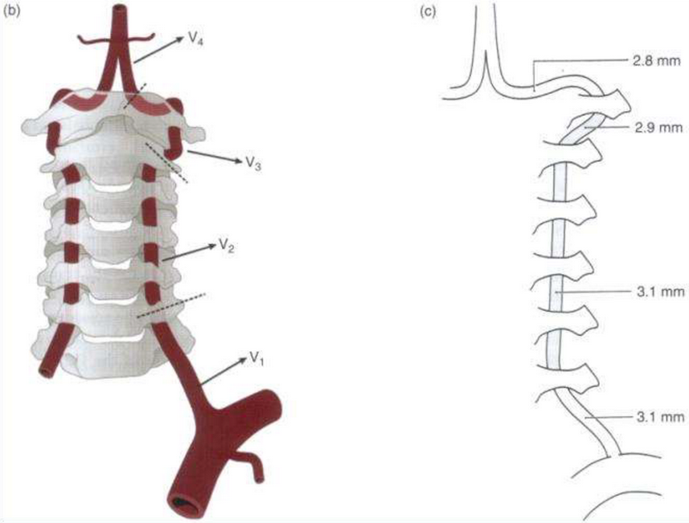
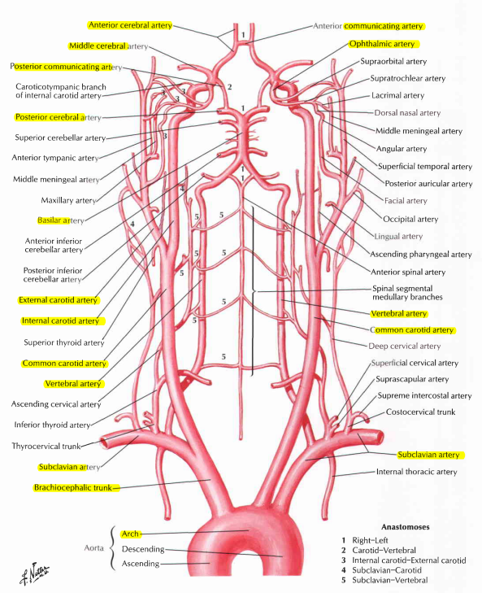
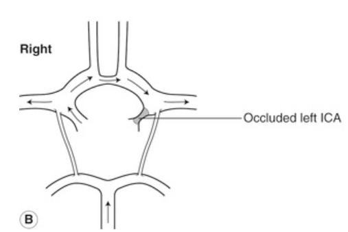
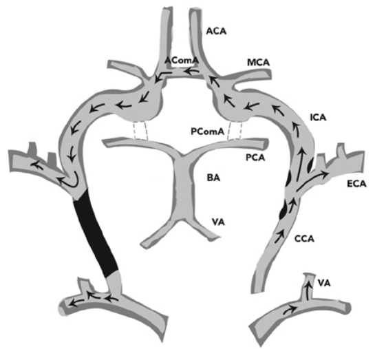

  <a href="https://sl-rad.github.io/SL-Rad-Vademecum">Home</a>
  <a href="https://sl-rad.github.io/SL-Rad-Vademecum/radiologia_tradizionale.html">Radiologia Tradizionale</a>
  <a href="https://sl-rad.github.io/SL-Rad-Vademecum/ecografia.html">Ecografia</a>
  <a href="https://sl-rad.github.io/SL-Rad-Vademecum/tomografia_computerizzata.html">Tomografia Computerizzata</a>
  <a href="https://sl-rad.github.io/SL-Rad-Vademecum/risonanza_magnetica.html">Risonanza Magnetica</a>
  <a href="https://sl-rad.github.io/SL-Rad-Vademecum/pronto_soccorso.html">Pronto Soccorso</a>
  <a href="https://sl-rad.github.io/SL-Rad-Vademecum/contatti.html">Telefoni</a>

- - -

# Anatomia Tronchi Sovra Aortici

- - - 

- [Anatomia Tronchi Sovra Aortici](#anatomia-tronchi-sovra-aortici)
	- [Circolo arterioso](#circolo-arterioso)
		- [ACC](#acc)
		- [ACI](#aci)
		- [ACE](#ace)
		- [AV](#av)
		- [Circoli collaterali](#circoli-collaterali)
	- [Bibliografia](#bibliografia)

- - -

## Circolo arterioso
 
 Costituito da:
 
 - Arteria Carotide Comune (ACC)
 - Arteria Carotide Interna (ACI)
 - Arteria Carotide Esterna (ACE)
 - Arteria Vertebrale (AV)
 
### ACC

Origine:
- A *destra* &rarr; **Arteria Brachiocefalica** (Arteria Innominata)
- A *sinistra* &rarr; **Arco Aortico** (prima della succlavia)

<a href="#anatomia-tronchi-sovra-aortici">⬆️</a>

---

### ACI

- Origina a livello del *bulbo carotideo*
- Nel 90% dei casi si localizza postero-lateralmente o lateralmente all'ACE
- Non ha rami collaterali extra-cranici
- **Porzione intracranica**:
	- Sifone carotideo
	- Arteria Cerebrale Media (ACM)
	- Arteria Cerebrale Anteriore (ACA)
- *Collaterale intracranico* &rarr; **Arteria Oftalmica**:
	- Rami terminali: 
		- Arteria Sopratrocleare
		- Arteria Sovraorbitaria
	- Si anastomizzano con rami terminali dell'ACE &rarr; circolo collaterale

<a href="#anatomia-tronchi-sovra-aortici">⬆️</a>

---

### ACE

- Origina a livello del *bulbo carotideo*
- Principali rami collaterali:
	- Arteria Tiroidea superiore
	- Arteria Linguale
	- Arteria Facciale
	- Arteria Mascellare

<a href="#anatomia-tronchi-sovra-aortici">⬆️</a>

---

### AV

Origina dall'**Arteria Succlavia** (bilateralmente). 
A livello della *VI vertebra cervicale* decorrono all'interno dei *forami trasversi* fino a raggiungere la base del cranio, dove si medializzano e si uniscono a formare l'**Arteria Basilare**.
Dall'Arteria Basilare hanno origine le **Arterie Cerebrali Posteriori (ACP)** &rarr; circolo posteriore.
- Le due AV sono asimmetriche &rarr; la sinistra è spesso più grande della destra
- Il decorso del vaso viene suddiviso in 5 segmenti:
	- V0: origine
	- V1: pre-trasversario
	- V2: cervicale (inter-trasversario)
	- V3: atlantoideo
	- V4: intracranico

<a href="#anatomia-tronchi-sovra-aortici">⬆️</a>

---

### Circoli collaterali

- **Arteria Oftalmica**:
	- In caso di patologia severa dell'ACI si instaura un circolo collaterale con l'ACE tramite l'Arteria Oftalmica
	- Osservabile al Doppler un flusso invertito

- **Circolo di Willis**
	- *Occlusione dell'ACI*
		- Vengono rifornite le ACM e ACA controlaterali tramite l'Arteria Comunicante Anteriore
		- Flusso invertito a livello dell'Arteria Cerebrale Anteriore

- *Occlusione dell'A. Succlavia prossimale*
	- Circolo collaterale fornito dall'AV controlaterale
	- Sottrae flusso all'encefalo &rarr; Sindrome da furto della succlavia
	- Al Doppler si osserva un flusso invertito a livello dell'AV dal lato della succlavia occlusa

<a href="#anatomia-tronchi-sovra-aortici">⬆️</a>

---

## Bibliografia

- NETTER, F. H. (2006). Atlas of human anatomy. Philadelphia, PA, Saunders/Elsevier.
- S. J. Hutchinson & K. C. Holmes, Principles of Vascular Ultrasound, *Carotid Artery Disease and Extracranial Cerebrovascular Disease*.

<a href="#anatomia-tronchi-sovra-aortici">⬆️</a>

---
