# Interpretazione curva spettrale Doppler

## Velocità di flusso e onda arteriosa

A ogni sistole il VSx immette in aorta 70 mL con pressione 120 mmHg.
La maggior parte della gittata sistolica serve a spingere in avanti  la colonna ematica -> *flusso assiale*
- 20% di questa energia si trasmette in senso radiale -> *flusso radiale*
- La dilatazione conseguente delle grandi arterie determina una riserva di energia potenziale -> in diastole viene ceduta per mantenere un flusso costante

	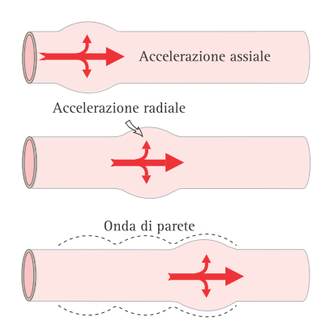

- Il flusso radiale genera un'onda di parete (*polso arterioso*) -> velocità in m/s
	- Dipende dall'elasticità della tonaca media -> più lenta in arterie elastiche, più veloce nelle arterie sclerotiche

### Forma dell'onda
- **Incisura dicrota**: chiusura valvola semilunare aortica + contropulsazione di parete generata dall'onda stazionaria che si genera per riflessione dell'onda sfigmica a livello delle biforcazioni
	- Coincide con inizio della diastole

	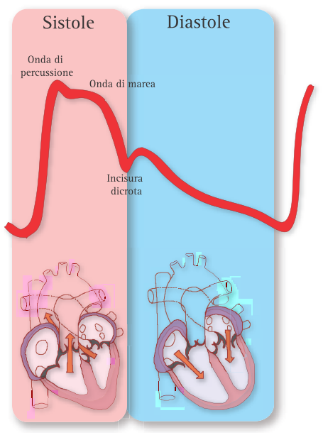

- **Onda reverse**: deflessione negativa nel versante discendente dell'onda causata da un effetto di rimbalzo dell'onda incidente a livello delle ramificazioni e delle diramazioni periferiche vasocostrette	

	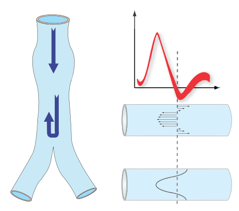

### Parametri da considerare
I seguenti sono due parametri ben distinti
- *Velocità di propagazione dell'onda arteriosa (onda di parete)*
	- Ordine di grandezza: m/s
	- Accelera progredendo verso la periferia
- *Velocità di scorrimento della colonna ematica*
	- Ordine di grandezza: cm/s
		- Aorta discendente: 40 cm/s
		- Grosse arterie: 60-100 cm/s in arterie renale, 100-120 cm/s in arteria iliaca
		- Piccole arterie: 10-15 cm/s
		- Capillari: mm/s
	- E' la velocità misurata dal Doppler

Ulteriore parametro che si può ottenere dalla velocità di scorrimento della colonna ematica è la **portata di flusso**
- Volume di sangue che attraversa la sezione di un vaso nell'unità di tempo
- I fattori che influenzano il flusso parenchimale (e la portata) sono:
	- La differenza di pressione tra distretto arterioso e venoso
	- La resistenza
- La formula per la portata è: Q=S x V (S superficie, V velocità)

---

## Profilo di scorrimento
Il sangue è costituito da una parte corpuscolata e una parte fluida. Questo fa sì che il sangue scorra secondo delle lamelle concentriche (*streamlines*). 
Nello scorrimento del sangue si genera dell'*attrito* (determinato dalla viscosità):
- Attrito parietale
- Attrito tra una lamella e l'altra 

Ogni lamella presenta una propria velocità di scorrimento -> si genera un *gradiente trasversale di velocità*:
- Dipende dalla viscosità che genera attrito
- Nei fluidi non newtoniani la viscosità si modifica in rapporto al gradiente di velocità
- Nei fluidi newtoniani la viscosità è fissa, indipendentemente dalla velocità

Occorre inoltre distinguere il comportamento dei fluidi Newtoniani (l'acqua) da quello dei fluidi non Newtoniani (il sangue):
- **Flusso laminare o di Poiseuille**
	- Tipico dei *liquidi non Newtoniani*
	- Caratterizzato da una maggiore velocità di scorrimento al centro del tubo
	- Si genera perchè la viscosità tende a diminuire al crescere del gradiente trasversale di velocità
	- Presenta un profilo parabolico che segue l'equazione di Poiseuille
	- Questo tipo di flusso si osserva nei vasi con diametro 1-2 mm
	- Conseguenza sulla curva spettrale -> spettro ampio
- **Flusso piatto o Plug Flow**
	- Si osserva nei vasi di maggior calibro -> gli effetti dell'attrito parietale si riducono rapidamente
	- Risponde alla teoria dello strato limite -> le linee di flusso hanno velocità molto simile, ad eccezione dello strato limite (strato a ridosso della parete vascolare)
	- Profilo di flusso piatto e uniforme
	- Conseguenza sulla curva spettrale -> spettro stretto

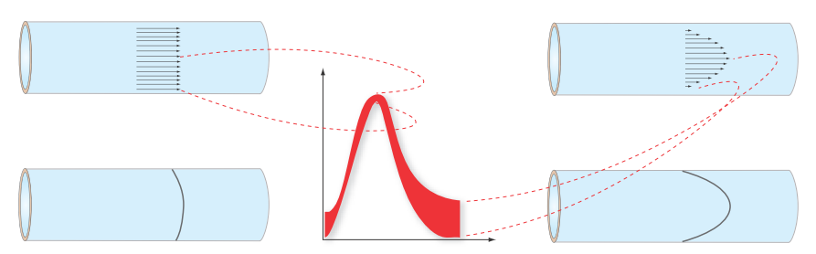

Il flusso rimane laminare finchè non supera un certo limite di:
- velocità (velocità critica)
- calibro
- densità e viscosità del sangue
Oltre questo limite si generano dei movimento "non laminari" che dissipano l'energia cinetica in calore.

La soglia critica viene definita dal **Numero di Reynolds**:
- Numero adimensionale -> Formula: $R_e = (D · V) / (\delta · \eta$)
- Nel sangue ha un valore di 2000
- Quando si avvicina a questo numero (per alterazione di diametro, velocità, densità o viscosità) il flusso diventa turbolento
- Oltre questa soglia l'incremento di pressione di perfusione non determina un incremento di velocità (non è più utile per la progressione della colonna ematica), ma l'energie cinetica viene convertita in calore -> danno endoteliale.

Questo flusso viene perturbato nei punti di passaggio:
- Confluenze venose
- Biforcazioni arteriose
- Placche ateromasiche

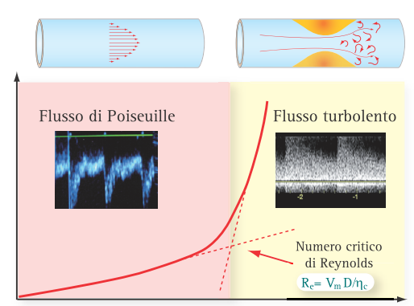

---

## Curva spettrale nel settore arterioso
### Flusso assiale e radiale
- **Flusso assiale**
	- Accelerazione sistolica della colonna ematica
	- Frenato esclusivamente dalle resistenze periferiche
	- Detto *Flusso resistivo*

- **Flusso radiale**
	- Accelerazione radiale della colonna ematica
	- Influenzato dalla capacitanza
	- Detto *flusso di capacitanza*

L'ampiezza dei flussi dipende da:
- resistenze periferiche
- capacitanza
- induttanza (inerzia e massa sanguigna)

### Curva ad alta e bassa resistenza
**Curva monofasica a bassa resistenza**
- Costituita da:
	- *Flusso continuo*:
		- Flusso indispensabile per il fabbisogno di ossigeno e glucosio ai parenchimi nobili
		- Dipende dalle resistenze circolatorie
		- Compreso tra linea zero flow e linea zero vera
	- *Flusso discontinuo o pulsato*
		- Quota di flusso dipendente dall'azione cardiaca e dalle resistenze periferiche
	- *Finestra sisto-diastolica*
		- Area sottesa alla curva sisto-diastolica
- Sistole: brusca accelerazione assiale
- Diastole: Decelerazione prolungata
	
	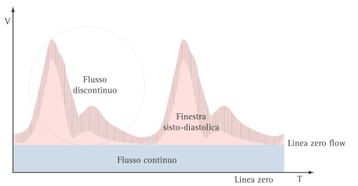

**Curva trifasica ad alta resistenza**
- Flusso continuo nullo ->  curva V/t rappresentata solo da flusso pulsato/discontinuo

	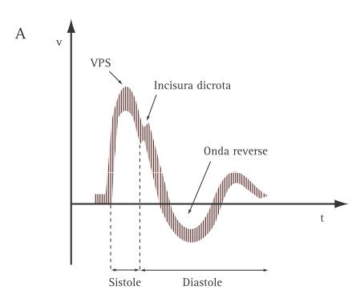

- Tratti:
	- *Tempo di latenza dell'onda*: ritardo con cui l'onda arriva in periferia
	- *Fronte di ascesa sistolico*: rapida accelerazione per l'eiezione ventricolare
	- *Incisura dicrota*: chiusura valvole semilunari aortiche + incontro onda arteriosa incidente con quella riflessa dalle biforcazioni arteriose
	- *Decelerazione diastolica*: perdita di spinta assiale
	- *Onda reverse*: rimbalzo della colonna ematica contro le resistenze e le diramazioni periferiche vasocostrette
	- *Flusso diastolico lento*

	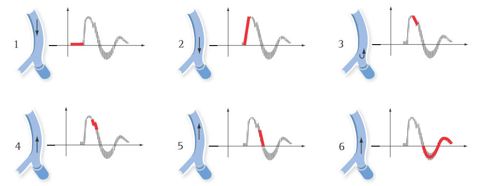

---

## Variazione curva V/t in funzione delle resistenze
Le resistenze vascolari vengono definite grazie all'equazione di Poiseuille:

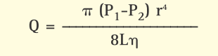

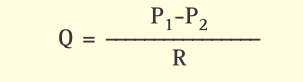

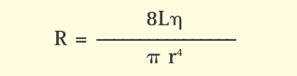

Conseguenza -> grande importanza del raggio del vaso

Si può testare l'effetto della modificazione del raggio con due test:
- *Test dell'ischemia a pugno chiuso* (arteria radiale)

	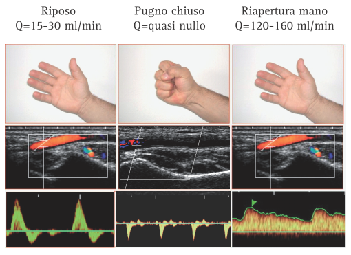
- *Iperventilazione e apnea* (arteria carotide interna)
	- Iperventilazione -> ipocapnia -> vasocostrizione
		- Riduzione picco sistolico
		- Decelerazione diastolica più marcata
		- Quasi assenza di flusso telediastolico
	- Apnea -> ipercapnia -> vasodilatazione
		- Picco sistolico maggiore
		- Attenuazione della decelerazione diastolica
		- Flusso diastolico persiste per tutta la diastole 

### Effetti emodinamici a monte e a valle di una stenosi
**A monte** si osserva:
- Riduzione in ampiezza del tracciato, a scapito soprattutto della diastole
- Fase di decelerazione più marcata

La presenza di una stenosi provoca la modifica **a valle** della curva in varie fasi:
1. Riduzione in ampiezza con scomparsa delle modulazioni rapide precoci
2. Scomparsa dell'onda reverse
3. Slargamento del complesso sistolico
4. Flusso appiattito con lieve modulazione sistolica
5. Flussi terminali

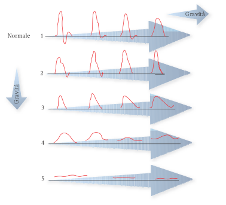

Conseguenza di ciò è la formazione di un flusso quasi costante a valle.

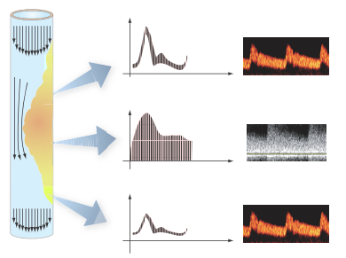

### Effetti emodinamici diretti di una stenosi
- *Incremento velocità nel tratto stenotico*
	- Effetto Venturi -> a parità di quantità di sangue se si riduce il raggio aumenta la velocità
- *Convergenza linee di flusso nel tratto prestenotico*
	- La convergenza provoca disturbo e dispersione della velocità
	- Cambia l'angolo di incidenza del fascio US -> sottostima della velocità e della severità di stenosi

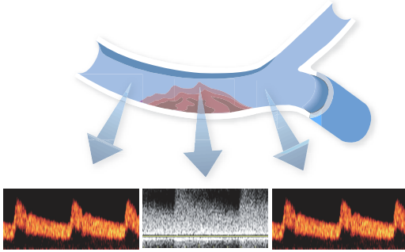

-  *Aumento tensione transmurale post-stenotica*
	-  Nel passaggio da stenosi a tratto post-stenotico si formano linee di flusso di ricircolo e linee di flusso reverse
	-  Provocano l'aumento della tensione transmurale (legge di Laplace) -> sfiancamento del vaso
	-  Facilita processi di trombosi e peggioramento della stenosi
	-  Le linee di flusso riacquistano il profilo laminare 2-3 cm a valle della stenosi

**Effetti nella curva spettrale per % di stenosi**
- Stenosi < 50% (superficie regolare)

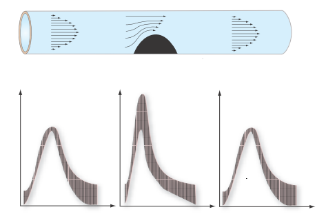

- Stenosi < 50% (superficie irregolare)
	- A livello della stenosi si ha modesta dispersione spettrale + modesta accelerazione sistolica

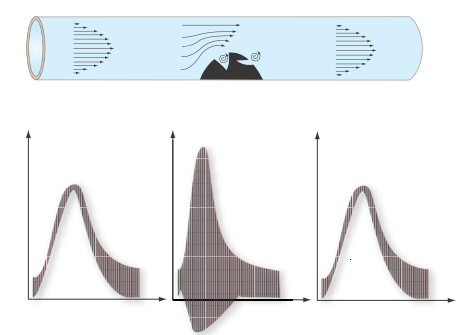

- Stenosi 50-90%

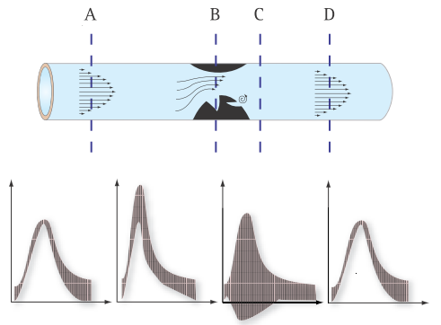

- Stenosi > 90%
	- Marcata dispersione dello spettro
	- Velocità elevatissime a livello della stenosi
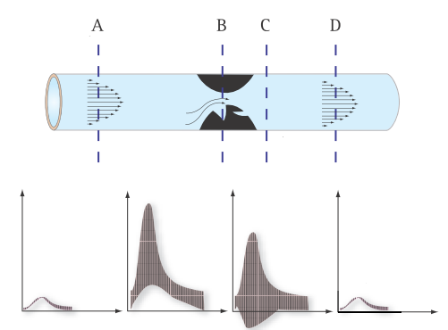

### Effetti del circolo collaterale

**Territorio ad alta resistenza**
- Stenosi completa
	- A ridosso dell'ostruzione -> complesso stump-flow (rimbalzo dell'onda di parete sull'ostruzione)
	- A valle: appiattimento complessi sistolici fino alla scomparsa

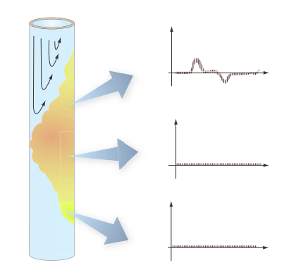

- Stenosi parzialmente compensata
	- A valle: demodulazione della curva -> riduzione componente pulsatile
	- Riduzione in ampiezza dell'onda + allargamento complesso sistolico
	- Perdita onda reverse

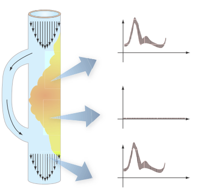

- Stenosi compensata

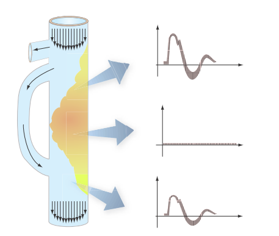

Quando un *vaso* arterioso viene *riabitato a valle* dell'ostruzione mediante vasi collaterali acquisisce un *aspetto* *monofasico*:
- Sistolico slargato
- Bassa ampiezza
- No onde reverse

Questo aspetto indica che il sistema arterioso ha *attivato tutte le possibilità di compenso*
- Nell'arto inferiore la marcia e lo sforzo fisico determinano *claudicatio*

---

**Territorio a bassa resistenza**

Il flusso continuo rappresenta un flusso di riserva -> la presenza di una stenosi introduce una resistenza in serie
- A valle la stenosi determina caduta del flusso diastolico
- Aumenta l'[[Indice di resistenza]] (si avvicina a 1)
- In caso di stenosi serrata scompare il flusso diastolico con appiattimento del complesso sistolico

---

## Parametri descrittivi della curva spettrale
### Analisi qualitativa

- Analisi morfologica delle strutture vascolari (ectasia, aneurisma, stenosi, ecc)
- Stabilire il carattere del flusso (pulsato o continuo) per discriminare la natura arteriosa o venosa
- Valutare lo stato di pervietà del vaso
- Valutare la direzione del flusso

### Analisi quantitativa (velocità)

Dipendono dall'angolo di insonazione (per l'equazione del Doppler Shift)

- Velocità di Picco Sistolico (VPS)
- Velocità Telediastolica (VD)
- Velocità Media (Vm)

### Analisi semiquantitativa (impedenza)

La forma e la morfologia dell'onda velocitometrica variano in rapporto all'impedenza vascolare e alle condizioni del circolo prossimale e distale.
L'impedenza è la somma dei fattori che contribuiscono a creare la resistenza al flusso:
- Induttanza (inerzia del sangue)
- Capacitanza (elasticità della parete)
- Resistenza

A parità di induttanza e capacitanza, un'alterazione delle resistenze per una stenosi o per vasocostrizione provoca una modifica della curva velocitometrica.
Per misurare l'impedenza sono stati proposti numerosi parametri semiquantitativi, indipendenti dall'angolo di insonazione, tra cui i più utilizzati sono:

- L'indice di Pulsatilità (IP)
	
	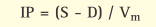
	- Dove S è la velocità sistolica massima, D la velocità telediastolica minima e Vm la velocità media.
	- Viene utilizzato per valutare l'impedenza nei territori vascolari ad alta resistenza (curva trifasica)
	- E' influenzata da stenosi, resistenze periferiche e dalla frequenza cardiaca

- L'indice di Resistenza (IR)

	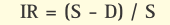
	-  Dove S è la velocità sistolica massima e D la velocità telediastolica minima
	-  Serve a stimare l'impedenza nelle arterie dei territori vascolari a bassa resistenza (curva monofasica)
