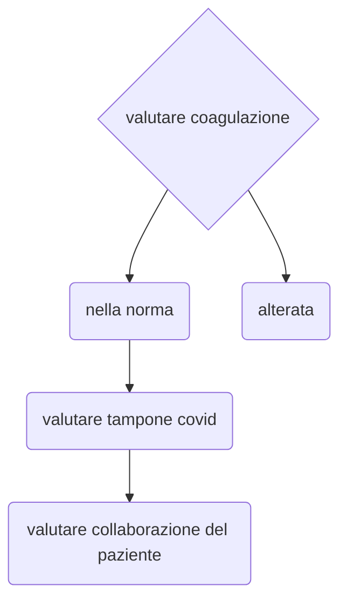

```mermaid
graph TD;
    inr{valutare coagulazione}
	inr-->inr_ok(nella norma)
	inr-->inr_no(alterata)
	inr_ok-->covid(valutare tampone covid);
	covid-->psi(valutare collaborazione del paziente)

```