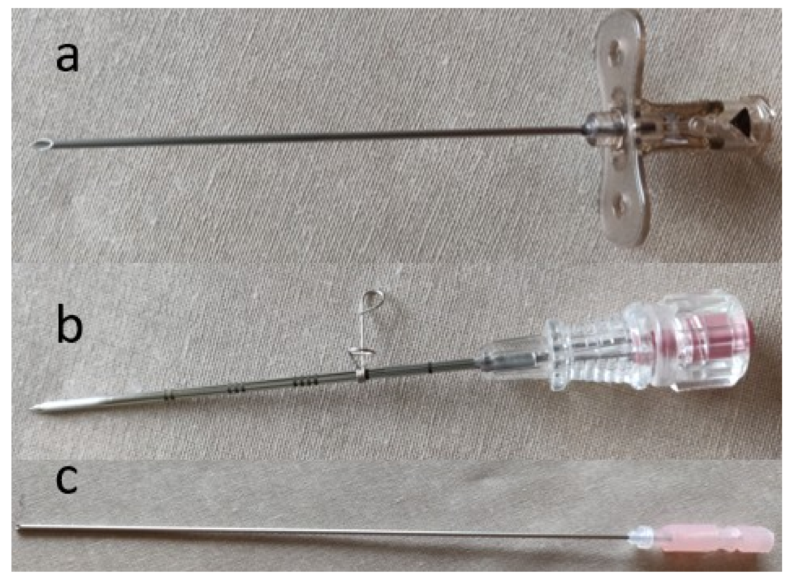

  <a href="https://sl-rad.github.io/SL-Rad-Vademecum">Home</a>
  <a href="https://sl-rad.github.io/SL-Rad-Vademecum/radiologia_tradizionale.html">Radiologia Tradizionale</a>
  <a href="https://sl-rad.github.io/SL-Rad-Vademecum/ecografia.html">Ecografia</a>
  <a href="https://sl-rad.github.io/SL-Rad-Vademecum/tomografia_computerizzata.html">Tomografia Computerizzata</a>
  <a href="https://sl-rad.github.io/SL-Rad-Vademecum/risonanza_magnetica.html">Risonanza Magnetica</a>
  <a href="https://sl-rad.github.io/SL-Rad-Vademecum/pronto_soccorso.html">Pronto Soccorso</a>
  <a href="https://sl-rad.github.io/SL-Rad-Vademecum/contatti.html">Telefoni</a>

- - -

# RADIOLOGIA INTERVENTISTICA

- - -

- [RADIOLOGIA INTERVENTISTICA](#radiologia-interventistica)
  - [**AGOBIOPSIA EPATICA CEUS-GUIDATA**](#agobiopsia-epatica-ceus-guidata)
  - [**AGOBIOPSIA ECOGUIDATA SEDI PROFONDE**](#agobiopsia-ecoguidata-sedi-profonde)
  - [**DRENAGGIO PERCUTAENO ECOGUIDATO**](#drenaggio-percutaeno-ecoguidato)
  - [INDICAZIONI](#indicazioni)
  - [CONTROINDICAZIONI](#controindicazioni)
  - [PROCEDURA](#procedura)
  - [**PARACENTESI ECOGUIDATA**](#paracentesi-ecoguidata)
    - [INDICAZIONI](#indicazioni-1)
      - [Diagnostiche:](#diagnostiche)
      - [Terapeutiche:](#terapeutiche)
    - [CONTROINDICAZIONI](#controindicazioni-1)
      - [Assolute:](#assolute)
      - [Relative:](#relative)
    - [MATERIALE](#materiale)
    - [PROCEDURA](#procedura-1)
      - [Tecnica statica](#tecnica-statica)
      - [Tecnica dinamica](#tecnica-dinamica)
      - [Esami sul liquido ascitico](#esami-sul-liquido-ascitico)
    - [COMPLICAZIONI](#complicazioni)
    - [REFERTO PROCEDURA](#referto-procedura)
  - [**DRENAGGIO PERCUTANEO TC GUIDATO**](#drenaggio-percutaneo-tc-guidato)
  - [**POSIZIONAMENTO/RIMOZIONE PICC**](#posizionamentorimozione-picc)
  - [**RADIOFREQUENZA PERCUTANEA LESIONE NODULARE EPATICA**](#radiofrequenza-percutanea-lesione-nodulare-epatica)
  - [**BIOPSIA LINFONODALE ECOGUIDATA**](#biopsia-linfonodale-ecoguidata)
  - [**AGOBIOPSIA TORACICA ECOGUIDATA**](#agobiopsia-toracica-ecoguidata)
  - [**AGOBIOPSIA ECOGUIDATA**](#agobiopsia-ecoguidata)
  - [**AGOBIOPSIA ECOGUIDATA TESSUTI SUPERFICIALI**](#agobiopsia-ecoguidata-tessuti-superficiali)
  - [**AGO BIOPSIA POLMONARE TC GUIDATA**](#ago-biopsia-polmonare-tc-guidata)
    - [MATERIALE](#materiale-1)
    - [PROCEDURA](#procedura-2)
    - [REFERTO - AGOBIOPSIA TORACICA TC GUIDATA](#referto---agobiopsia-toracica-tc-guidata)
  - [MATERIALE](#materiale-2)
    - [AGO DI CHIBA](#ago-di-chiba)
  - [CHECKLIST PRE-PROCEDURALE](#checklist-pre-procedurale)
    - [PIANIFICAZIONE DELLA PROCEDURA](#pianificazione-della-procedura)
    - [CHECKLIST PRE-PROCEDURA](#checklist-pre-procedura)
    - [CHECKLIST POST-PROCEDURA](#checklist-post-procedura)
  - [Fine Needle Aspiration (FNA)](#fine-needle-aspiration-fna)
    - [Indicazioni](#indicazioni-2)
    - [Controindicazioni](#controindicazioni-2)
    - [Procedure](#procedure)
  - [**POSIZIONAMENTO HOHN**](#posizionamento-hohn)
    - [Catetere di Hohn](#catetere-di-hohn)
    - [MATERIALI](#materiali)
    - [PROCEDURA POSIZIONAMENTO](#procedura-posizionamento)
  - [POSIZIONAMENTO PORT](#posizionamento-port)
  - [**CONSULENZA RADIOLOGICA**](#consulenza-radiologica)
    - [2022/04/05 \| NODULO POLMONARE LID + NODULO TIROIDEO / LINFONODO &rarr; RT](#20220405--nodulo-polmonare-lid--nodulo-tiroideo--linfonodo--rt)
  - [BIBLIOGRAFIA](#bibliografia)
  - [NOTE](#note)

- - -

## **AGOBIOPSIA EPATICA CEUS-GUIDATA**

<a href="#radiologia-interventistica">⬆️</a>

---

## **AGOBIOPSIA ECOGUIDATA SEDI PROFONDE**

<a href="#radiologia-interventistica">⬆️</a>

---

## **DRENAGGIO PERCUTAENO ECOGUIDATO**

## INDICAZIONI
Qualsiasi raccolta fluida anomala accessibile:

- **Ascesso diverticolare** complicato
- **Ascesso** correlato al **Morbo di Crohn**
- Appendicite complicata con **ascesso appendicolare**
- **Ascesso tuboovarico**
- Prelievi di liquidi post-chirurgici
- **Ascesso epatico** 
   - amebico 
   - post-operatorio
- **Ascesso renale **
- **Ascesso retroperitoneale**
- **Ascesso splenico**

## CONTROINDICAZIONI
Le controindicazioni comuni sono:

- target non è accessibile
- diatesi emorragica

## PROCEDURA

h 11:00 
Sotto **guida ecografica **
è stato posizionato un **catetere di drenaggio** del calibro di **8.4 F** 
nella **raccolta** già nota in sede **parietocolia sinistra**.

Sono stati evacuati circa **20 cc di fluido purulento** 
di cui si allega un **campione** per gli **esami di laboratorio**. 

Al termine della procedura il **catetere** è stato **lasciato in sede**, 
assicurato alla cute con un **punto di seta**, 
**raccordato** a **sacca danese** per essere gestito dai Medici Curanti. 

Il **controllo ecografico** al termine della procedura **non** ha evidenziato **complicanze immediate**; 
si consiglia **emocromo** di controllo **tra circa due ore**.

<a href="#radiologia-interventistica">⬆️</a>

---

## **PARACENTESI ECOGUIDATA**

### INDICAZIONI

#### Diagnostiche:

- **ascite** di nuova diagnosi
  - determinare l'**eziologia** dell'ascite
  - valutare **peritonite batterica**

#### Terapeutiche:

- **alleviare** effetti **pressione ascite** &rarr; **compromissione respiratoria**

### CONTROINDICAZIONI

#### Assolute:

- **addome chirurgico**

#### Relative:

- coagulopatia (**INR >2,0**)
- grave trombocitopenia (conta delle **piastrine <50 x 103/μl**)
- **cellulite** della parete addominale
- **gravidanza**
- **distensione** della **vescica**
- **aderenze intra-addominali**
- **ileo massiccio**

### MATERIALE

### PROCEDURA

Prima di eseguire la procedura:

1. Valutare quantità e natura dell'ascite in TC o in ecografia
2. Valutare il profilo di coagulazione del paziente
3. Ottenere il consenso informato
4. Valutare indicazione alla procedura per determinare il volume di liquido da rimuovere

5. Procedere in sterilità
6. Infiltrazione di anestetico locale

7. Il paziente può essere posizionato per consentire l'accumulo di fluido su un lato

> La procedura può essere eseguita:
>
> - alla cieca utilizzando la tecnica del punto di riferimento
>   - 15 cm lateralmente all'ombelico nel quadrante inferiore destro o sinistro
> - dopo la marcatura ecografica prima della procedura
> - sotto guida d'immagine tipicamente con guida ecografica.

La guida ecografica può essere utilizzata in modo dinamico o statico; obiettivi della scansione pre-procedurale:

- **identificazione** della **raccolta** ascitica **di dimensioni maggiori**
  - la **dimensione minima di sicurezza** di una falda ascitica deve essere **> 3 cm**
- dove la **parete addominale** è **priva di vasi** o eccessivo tessuto adiposo

#### Tecnica statica

Il sito di ingresso ideale è segnato con **due linee perpendicolari** che indicano la posizione della sacca di fluido mirata, **l'ago** viene **inserito** in modo **perpendicolare** all'**incrocio delle linee** di marcatura.

#### Tecnica dinamica

1. Si può utilizzare una visualizzazione:
   - sull'asse corto
    - visualizzazione intermittente della punta dell'ago
   - sull'asse lungo
    - permette la visualizzazione dell'ago durante tutta la procedura
	> Entrambi gli approcci richiedono un **angolo di ingresso di 45 gradi**

2. Un **ago 18G** con una **siringa da 10 mL** viene passato usando una **tecnica a Z** per **ridurre** al minimo il **rischio** di **perdite persistenti dopo la rimozione**.
3. La **pressione negativa** viene mantenuta sulla siringa **fino all'aspirazione del liquido ascitico**,
4. successivo **avanzamento del catetere**,
5. **rimozione dell'ago**
6. **fissaggio di un rubinetto a tre vie**.

> La **tecnica Seldinger** può essere usata per lasciare un catetere di ~8 Fr in situ per le procedure terapeutiche.
>
> In alternativa, può essere utilizzato anche un **set di cateteri trocar**.

#### Esami sul liquido ascitico

Il fluido può essere inviato per i seguenti test:

- colorazione di **Gram**, **coltura** e **sensibilità**
- **conteggio delle cellule** (soprattutto **neutrofili**)
- **citologia**
- livelli di **albumina** (per valutare il **gradiente di albumina dell'ascite sierica (SA-AG)**)
- livello di **trigliceridi** (elevato nell'**ascite chilosa**)
- livello di **glucosio**
- livello di **lattato deidrogenasi**
- livello di **amilasi** (suggerisce una **patologia pancreatica**)
- **pH**

Dopo la procedura, bisogna fare attenzione alle procedure terapeutiche per evitare grandi spostamenti di liquidi.

L'albumina deve essere sostituita per via paraenterale per evitare disequilibri responsabili di rischi di collasso circolatorio post-paracentesi, più comuni quando vengono drenati >5 litri di liquido.

I diuretici, la restrizione di sale e acqua sono frequentemente utilizzati.

### COMPLICAZIONI

- Infezione localizzata
- Perforazione intestinale
- Perdita persistente di liquido ascitico
  - può essere raccolta nella sacca della stomia fino alla guarigione
  - minimizzata con la tecnica Z-track
- Emorragia
  - locale
  - intraperitoneale
   - dovuta a bassa conta piastrinica
   - INR elevato
   - bassi livelli di fibrinogeno nel siero
- Collasso circolatorio
  - minimizzato sostituendo volume e albumina
- Sindrome epato-renale

### REFERTO PROCEDURA

Sotto **guida ecografica**
è stata eseguita la **paracentesi** in (**fossa iliaca destra**),
mediante **ago da paracentesi** da (18 G).

Sono stati evacuati **(50 cc) di fluido (paglierino)**,
di cui si allega un **campione** per gli **esami di laboratorio**.

Al **controllo US** al termine della procedura
**non** si evidenziano **complicanze immediate**
e si collega il sistema alla **sacca Danese**.

<a href="#radiologia-interventistica">⬆️</a>

---

## **DRENAGGIO PERCUTANEO TC GUIDATO**

Con **guida TC** ed **approccio laterale**
è stato eseguito **dreanaggio** della nota **raccolta retro cardiaca sinistra polmonare omolaterale**
utilizzando dapprima **ago di CHIBA 21 x 20 cm** (anche **con tecnica a doppia infissione**)
e successivamente mediante **ago da 18 G**.

Il **liquido** drenato, **sieroso** (**circa 50 cc**)
è stato raccolto in **due beute distinte** per le opportune **analisi di laboratorio**.
**Non** si evidenziano **complicanze maggiori immediate**.
Si rimane a disposizione dei colleghi Curanti per qualsiasi chiarimento,

<a href="#radiologia-interventistica">⬆️</a>

---

## **POSIZIONAMENTO/RIMOZIONE PICC**

<a href="#radiologia-interventistica">⬆️</a>

---

## **RADIOFREQUENZA PERCUTANEA LESIONE NODULARE EPATICA**

<a href="#radiologia-interventistica">⬆️</a>

---

## **BIOPSIA LINFONODALE ECOGUIDATA**

<a href="#radiologia-interventistica">⬆️</a>

---

## **AGOBIOPSIA TORACICA ECOGUIDATA**

<a href="#radiologia-interventistica">⬆️</a>

---

## **AGOBIOPSIA ECOGUIDATA**

<a href="#radiologia-interventistica">⬆️</a>

---

## **AGOBIOPSIA ECOGUIDATA TESSUTI SUPERFICIALI**

<a href="#radiologia-interventistica">⬆️</a>

---

## **AGO BIOPSIA POLMONARE TC GUIDATA**

- valutare **PT**, **INR**, **piastirine**
- valutare **tampone covid**
- **parlare con Paziente** per vedere se è **collaborante**
  - se paziente agitata (**ansiosa**) **lexotan 8gtt** in bicchiere (beve con cannuccia)
    - se Paziente non collaborante la procedura non può essere eseguita
  - far firmare il **conseso informato**
- vedere **lettera del GIC**/**referto oncologia**
- vedere **precedenti TC/PET**
  - visionare **l'ultima PET** per **determinare le regioni maggiormente captanti** della lesione al fine di utilizzarle come **target**
- su richiesta dell'anatomo-patologo
  - misurare **dimensione della lesione**
  - le **caratteristiche TC**:
    - **margini** rotondeggiandi/spiculati
    - **enhancement** contrastografico
    - **captazione FDG** in SUV

> Il valore di SUV (Standardized Uptake Value) è un parametro semi-quantitativo valutabile negli esami FDG-PET/SPECT che indica l'intensità di emissione di una determinata lesione in rapporto alla dose totale iniettata in rapporto alla massa corporea.
>
> Rappresenta un parametro funzionale che suggerisce l'elevata attività metabolica di una struttura o di una lesione. Tipicamente un valore superiore ai 2,5 può indicare una lesione neoplastica.
>
> Un valore di SUV pari a 1 indica un'area con captazione pari al resto dell'organismo.

### MATERIALE

- marker cutaneo
- guanti sterili
- telo sterile
- telo forato sterile
- lidocaina 8mL + 2mL bicarbonato
- siringa 10mL
- ago 20 per asprazione (bianco)
- ago 22 per inizione (nero)
- coassiale 
- tru-cut 18G x 200 mm

### PROCEDURA

- monitorare saturazione e frequenza cardiaca del paziente
- scout
- scansione iniziale
- posizionare griglia
- valutare dove posizionare marker cutaneo (misurare distanza in cm su schermo)
- centrare lesione (centratura laser)
- misurare la distanza con metro dalla centratura laser
- segno con pennarello su cute
- posizionare marker con adesivo
- scansione per visionare repere
- misurare distanza tra repere e pleura (e repere e lesione)

DA QUI PROCEDERE IN STERILITA'

- indossare guanti sterili
- accedere con ago da anestesia (22G) di pochi
- iniettare anestesia locale con ago da 22G (lidocaina 8mL + 2mL bicarbonato)
  - non raggiungere la plera ma iniettare solo i tessuti superficiali
- scansione di controllo con ago da anestesa ancora dentro ???
- rimuovere l'ago da anestesia
- posizonare il coassiale lungo il decorso dell'ago da anestesia
- scansione di controllo
  - far attenzione a posizionarlo a senza superare la pleura
    - mantenere una distanza > 1cm ??? dalla pleura
- caricare l'ago tru-cut a due scatti (20 mm)
- rimuovere il mandrino del coassiale
  - dopo aver rimosso il mandrino tappare il canale non un dito
    > tappare il buco impedisce gli cambi di aria tra interno ed esterno minimizzando il rischio di infezione e preserva la pressione interna diminuendo il rischio di PNX.
- accedere con ago tru-cut attraverso il coassiale
- arrivati alla pleura far accedere il tru-cut picchiettandolo con il dito sul grilletto in modo da avere un miglior accesso
- scansione di controllo
  - valutare la posizione della punta dell'ago
- rientrare in sala
- informare il paziente che sentirà lo scatto di una molla e di non preoccuparsi
- scattare con il tru-cut
- uscire con il tru-cut
- tappare con dito il foro del coassaile
- riposizionare il mandrino del coassiale a 3/4
  - in questo modo il canale del coassiale è sigillato ma la punta del mandrino e interna al canale e non può ledere i tessuti
- far eseguire scan di controllo
- spostarsi alla postazione degli anatomi-patologi
- ricaricare il tru-cut (2 scatti?)
- posizionandosi sopra la spugna far avanzare la punta del tru-cut senza farlo scattare
- depositare il frustolo di tessuto sulla spugnetta
  - ruotare di 3/4 in modo da facilitare il distacco del frustolo
    - il materiale deve essere preferibilmente disteso e integro
- mentre i patologi valutano l'idoneità della biopsia controllare la scansione di controllo per PNX o emorragia
- se richiesto secondo campione ripetere la procedura ruotando eventualmente il tru-cut di 180° al secondo scatto per evitare di scattare a vuoto
- uscire con trucut insieme al coassiale
- tamponare immediatamene con forza la zona interessata
- dopo la procedura controllare per PNX o soffusione emorragica.
- indicare RX del torace di controllo a 2 ore.

> Controllare con una scansione ogni volta che si posiziona l'ago, il pazinte si può essere mosso nel frattempo

### REFERTO - AGOBIOPSIA TORACICA TC GUIDATA
Con guida TC ed approccio anteriore destro è stata eseguita la biopsia sulla nota lesione polmonare
omolaterale utilizzando ago di TRU-CUT 18-15 cm (2 prelievi). Alla valutazione estemporanea anatomo-patologica il prelievo risulta idoneo. Non si evidenziano complicanze maggiori immediate segnalando minima soffusione perilesionale. Si consiglia controllo a 2 ore dal termine della procedura con radiografia del torace. Termine della procedura ore: 9:40.

<a href="#radiologia-interventistica">⬆️</a>

---

##

<a href="#radiologia-interventistica">⬆️</a>

---

##

<a href="#radiologia-interventistica">⬆️</a>

---

##

<a href="#radiologia-interventistica">⬆️</a>

---

##

<a href="#radiologia-interventistica">⬆️</a>

---

##

<a href="#radiologia-interventistica">⬆️</a>

---

##

<a href="#radiologia-interventistica">⬆️</a>

---

## MATERIALE

### AGO DI CHIBA
L'ago Chiba è uno degli **aghi da biopsia/accesso percutaneo** più comunemente usati.

È un **ago cavo in due parti** con una **punta smussata** angolata a **30 gradi**.

Lo **stiletto interno** (anch'esso **smussato**) è **rimovibile**.

La smussatura dell'ago Chiba risulta in una guida superiore rispetto agli aghi trocar convenzionali.

Il suo calibro è tipicamente compreso tra 18-22 G e viene utilizzato principalmente per:

- la biopsia tissutale in aspirazione
- aspirare fluidi
- ottenere un accesso percutaneo all'albero biliare (ad esempio PTC) e al sistema pelvico-cefalico del rene.

Può anche essere usato per forare e quindi sgonfiare un palloncino intravascolare se non riesce a sgonfiarsi attraverso la sua stessa valvola.

> **TIPOLOGIE DI AGO**
> 
> 
> 1. Ago a singola parete con centro cavo
> 2. Ago trocar
> 3. Ago di Chiba

<a href="#radiologia-interventistica">⬆️</a>

---

## CHECKLIST PRE-PROCEDURALE

### PIANIFICAZIONE DELLA PROCEDURA
- Caso discusso con il medico curante/team multidisciplinare (GIC)
- Esami radiologici precedenti
- Anamnesi medica
- Consenso informato
- Profilassi
- Strumenti specifici presenti e richiesti
- Indicare digiuno al paziente
- Esami di laboratorio valutati 
   - emocromo (PLTs)
   - profilo della coagulazione (INR)
   - funzionalità renale (Creatinina, eGFR)
- Anestesista
- Interrompere terapia anti-coagulante
- Posto letto post-procedurale
- Indicare eventuale profilassi anti-allergica

### CHECKLIST PRE-PROCEDURA
- Presenti tutti i membri del team
- Identificare paziente
- Valutare se sito accesso corretto
- Paziente a digiuno
- Accesso EV se necessario
- Monitor attivo e collegato
- Screening della coagulazione e altri test di laboratorio pertinenti controllati
- Verifica delle allergie e/o della corretta profilassi
- Antibiotici e altri farmaci somministrati
- Spiegare la procedura al paziente, comprese le complicanze, e raccogliere il consenso

### CHECKLIST POST-PROCEDURA
- Referto post-procedura scritto
- Segni vitali nella norma durante la procedura
- Indicare i medicinali e mezzi di contrasto somministrati
- Esami di laboratorio richiesti
- Campioni etichettati e inviati al laboratorio
- Risultati della procedura discussi con il paziente
- Istruzioni post-dimissione impartite
- Appuntamento ambulatoriale di follow-up (o eventuale ecografia / RX / TC di controllo)
- Risultati della procedura comunicati al medico curante

## Fine Needle Aspiration (FNA)
L'aspirazione con ago sottile (FNA) è un tipo di campionamento tissutale minimamente invasivo. 
Tipicamente viene svolto sotto guida ecografica, sebbene a dipendenza del contesto sia possibile utilizzare anche la TC, la risonanza magnetica o la fluoroscopia.
La guida per l'imaging è di particolare utilità durante il campionamento di lesioni profonde o diffuse in quanto anche nel caso di una lesione delimitata e palpabile, la guida imaging consente un campionamento mirato di diverse regioni all'interno della lesione.

L'aspirazione con ago sottile (FNA) ottiene cellule per la valutazione anatomo-patologica. 
Il materiale raccolto contiene cellule disorganizzate che non mantengono più la disposizione spaziale che avevano originariamente nella lesione. 
Nel caso in cui ai fini dell'analisi istopatologica sia necessario preservare la disposizione spaziale delle cellule, occorre eseguire una biopsia del nucleo (core-biopsy).

### Indicazioni

Raccolta di materiale cellulare da:

- Tiroide
- Collo
  - Linfonodi parotidei
  - Linfonodi cervicali
- Seno
- Fegato
- Linfonodi
- Polmone
- Osso
- Tratto gastrointestinale
- Mediastino

### Controindicazioni

Controindicazioni assolute:
- diatesi emorragica incoercibile
- ipopiastrinemia

Controindicazioni relative:
- incapacità di sdraiarsiù
- difficoltà a controllare la frequenza e la profondità della respirazione 
  - più importante per le biopsie toraciche e addominali
  - ansia
  
 > L'impossibilità di raggiungere la lesione con l'ago, senza attraversare strutture importanti, è una controindicazione relativa da valutare a seconda delle strutture attraversate, dell'esperienza dell'operatore e della necessità della biopsia.

### Procedure
Valutazione preprocessuale
consenso del paziente e esame fisico mirato pre-procedura
se l'ecografia viene utilizzata come guida per l'imaging, viene comunemente eseguito un esame ecografico mirato pre-procedura
Attrezzatura
L '"ago sottile" in un FNA varia a seconda del sistema sottoposto a biopsia e della natura della lesione, ma in genere è un ago da 25 gauge a 27 gauge con uno stiletto. Per le procedure guidate dagli ultrasuoni, il trasduttore può avere una guida dell'ago.

Tecnica
La tecnica FNA varierà a seconda del sistema mirato e della natura della lesione. Le tecniche comuni a tutte le procedure includono:

anestesia locale con lidocaina tamponata al 2%.
facendo avanzare l'ago sottile sotto la guida dell'imaging fino a quando la punta non si trova nell'area prevista per la biopsia
rimozione dello stiletto
più brevi passaggi attraverso la lesione (riempimento dell'ago di cellule)
rimozione dell'ago con un'adeguata disposizione delle cellule (es. vetrino per striscio, contenitore per blocco cellulare)
di solito si ottengono più campioni in una sessione
Assistenza post-procedurale
Non esiste un'assistenza post-procedura standardizzata per FNA. La compressione del sito bioptico con una garza è comune per controllare il sanguinamento locale minore. Se il polmone viene sottoposto a biopsia , è possibile ottenere una radiografia post procedura

Complicazioni
Le complicanze sono rare con una tecnica FNA appropriata, solitamente limitate a sanguinamento o infezione. Il sanguinamento è più una preoccupazione per le aspirazioni addominali più profonde poiché raramente è possibile applicare una pressione diretta.

Il pneumotorace è un rischio di biopsie polmonari. È possibile ottenere una radiografia post-procedura o un'ecografia per cercare questa complicanza.

Il cracking tiroideo è una rara complicanza della biopsia FNA dei noduli tiroidei.

Risultati
Il successo dell'FNA si misura in termini di aspirazione di una quantità diagnostica di tessuto e mantenimento del comfort del paziente. 

Le percentuali di successo nell'aspirazione del tessuto diagnostico dipendono da molteplici fattori, non ultimo dei quali include la dimensione dell'ago utilizzato, la posizione della lesione e il tipo di lesione da sottoporre a biopsia. Gli aghi "sottili" di diametro maggiore catturano più tessuto per aspirazione e hanno maggiori probabilità di produrre tessuto diagnostico, ma i vantaggi dell'aspirazione minimamente invasiva diminuiscono.

Se un'aspirazione con ago sottile non restituisce materiale diagnostico, può essere ripetuta. In alternativa, se appropriato, può essere tentata una biopsia del nucleo.

Il mantenimento del comfort del paziente dipende da molteplici fattori, tra cui l'appropriata somministrazione dell'anestesia locale, la riduzione al minimo del numero di campioni e l'ottenimento di materiale sufficiente per evitare di dover richiamare il paziente. Gli ultimi due sono spesso in conflitto tra loro.

## **POSIZIONAMENTO HOHN**

### Catetere di Hohn
Catetere venoso centrale (CVC) **non tunnellizzato** in **silicone**.

**VANTAGGI**:

- maggior **facilità** e **rapidità** di **posizionamento**

**SVANTAGGI**:

- facilità di **rimozione accidentale**
- maggior rischio di **infezione**
- necessita di **medicazione periodiche**

### MATERIALI

- guanti sterili
- telo sterile
- telo forato sterile
- lidocaina 8mL + 2mL bicarbonato
- siringa 10mL
- ago 20 per asprazione (bianco)
- ago 22 per inizione (nero)
- Kit Catetere Hohn
- bisturi
- fisiologica sterile 500 mL per contenitore catetere

### PROCEDURA POSIZIONAMENTO

**PRIMA DELLA PROCEDURA**

- Valutare **RX Torace**
  - Fare attenzione a decidere l'idoneità o eseguire l'accesso se il **polmone** del lato **controlaterale** è interessato da **diffuso** processo di **addensamento** o da massivo **versamento** pleurico.
  Nel caso di **complicazioni della procedura**, nello specifico **PNX**, l'assenza di compenso ventilatorio dell'altro polmone può portare ad una **grave desaturazione** e **rischio di vita** per il paziente, a maggior ragione se anziano e fragile.

**PRIMA DI ACCEDERE IN SALA**
Per procedere necessario assistente per indossare il camice sterile &rarr; Tecnico radiologo / infermiere / oss di sala

1. Indossare **grembiule piombato** e **scudo tiroideo**
2. Accurato **lavaggio delle mani**
3. **Asciugare** mani con **telini sterili** presenti nel kit del camice sterile
4. Indossare **camice sterile**
5. L'assistente lega i **lacci interni non sterili** del camice
6. L'operatore prende il **laccio sterile del camice** e con l'appropiato aiuto dell'assistente lo lega in sterilità

**IN SALA**

L'assistente di sala ha solitamente predispone e assiste nel preparare il piano sterile di lavoro sull'allivo.

  

<a href="#radiologia-interventistica">⬆️</a>

---

## POSIZIONAMENTO PORT

<a href="#radiologia-interventistica">⬆️</a>

---

## **CONSULENZA RADIOLOGICA**

### 2022/04/05 \| NODULO POLMONARE LID + NODULO TIROIDEO / LINFONODO &rarr; RT 

2022/04/05
- Richiesta di FNA TC guidata per nodulo polmonare LID (+ nodularità collo)
- TC TOR (21/3/2022) = nota nodularità a margini polilobulati e lievemente sfrangiati e spiculati a livello del segmento apicale del LID del diamtero di 15 mm con enhancement mdc.
- PET post-TC = lesione LID ipercaptante (SUV 3.7) come anche verosimili linfoadenomegalie paratracheali alla base del collo (SUV 8.46).

> Massa polmonare singola di 15mm &rarr; T1b } SI &rarr; RT & FU
> Massa polmonare singola di 15mm + linfonodo sovraclaveare &rarr; T1b + N2 } SIIIA &rarr; chemio?

Pz affetto da enfisema (BPCO)
ricoverato in medicina per riacutizzazione di patologia ad ora stabile con O2 a 2L

> L'enfisema è un fattore di rischio per PNX post-biopsia polmonare

Non indicazione a biopsia endoscopistica

2022/04/05
Non indicazione alla biopsia ma da mantenere in folLow-up come da indicazioni NCCN?
> Le linee guida NCCN 3/2022 non danno mai indicazione a follow-up diretto ma valutare prima la possibilità di una radioterpia (RT) anche senza biopsia.

- trovare indicazioni e riportarle

Valutare in TC se quello che viene segnato come linfonodo non è piuttosto un nodulo tiroideo o un vaso.

Se non è un linfonodo allora avviare alla radioterapia se invece è sospetto fare ecografia e nel caso bioptare il linfonodo e se positivo per tumore allora automatiamente stadio IIIA ed avviare alla chemioterapia.

**REFERTO CONSULENZA**
*Esaminata la documentazione del Paziente.*

*Quanto alla lesione polmonare nel segmento apicale del lobo inferiore del polmone destro, si concorda con il giudizio dello Specialista Pneumologo di significativo rischio di pneumotorace in caso di una agobiopsia transtoracica TC-guidata; è inoltre da valutarsi la "riserva" respiratoria per stabilire la fattibilità di una resezione in caso di assai verosimile neoplasia primitiva in stadio IA (T1b, N0); qualora il Paziente sia da considerarsi a priori inoperabile, potrebbe essere utile una consulenza Specialistica di Radioterapia (possibile un trattamento senza tipizzazione?).*

*Relativamente alla circoscritta e intensa ipercaptazione alla base del collo alla PET, in sede pretracheale, il reperto coincide con un nodulo parzialmente calcifico indissociabile dal margine inferiore dell'istmo tiroideo e pertanto con origine attribuibile in prima ipotesi a tale organo (non distinguibile un nodo di struma da una neoplasia ben differenziata, ma reperto in ogni caso al momento irrilevante).*

*Disponibili a chiarimenti,*

---

<a href="#radiologia-interventistica">⬆️</a>

---

## BIBLIOGRAFIA

-[Patient Safety in Interventional Radiology: A CIRSE IR Checklist](https://link.springer.com/content/pdf/10.1007/s00270-011-0289-5.pdf)

---

## NOTE

